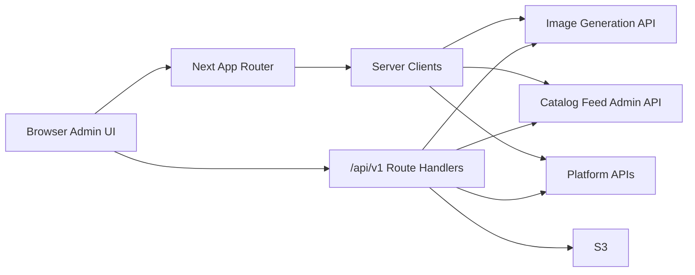
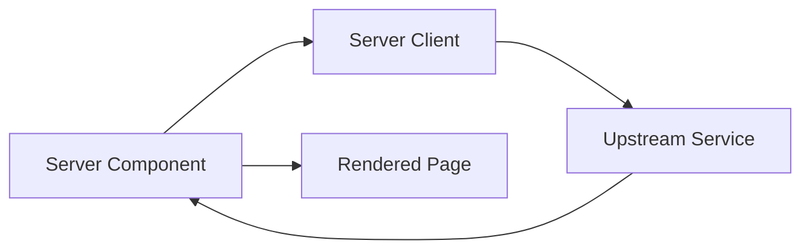
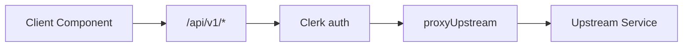

# Architecture

This app is a Next.js admin BFF for AI image evaluation workflows. It owns the admin UI, authentication boundary, lightweight proxy routes, and a few local adapters. It does not own the primary persistence layer.

## System Context



## Runtime Boundaries

### App Shell And Auth

- `src/app/layout.tsx` wraps the app with Clerk and `AppShell`.
- `src/proxy.ts` protects admin pages and initializes Clerk context for `/api/**`.
- Browser-accessed admin route handlers perform their own `auth()` checks because proxy/middleware protection alone does not authorize API routes.

### Server Reads

Server Components call typed server clients:

- `src/lib/service-client.ts` for image-generation reads.
- `src/lib/catalog-feed-client.ts` for catalog-feed admin reads.
- Feature-specific parsers live in smaller helper modules such as `src/lib/strategy-run-judge-results.ts`.

### Browser Mutations And Client Fetches

Client Components do not call upstream hosts directly. They use:

- `serviceUrl()` for `/api/v1/image-generation/**`.
- `localUrl()` for local BFF routes such as upload, products, projects, and design packages.
- `/api/v1/catalog-feed/**` for catalog-confidence admin mutations.

`src/lib/proxy-handler.ts` centralizes upstream proxy behavior: forwarded headers, body handling, network errors, malformed JSON, non-JSON pass-through, and upstream error logging.

## Service Responsibilities

| Area                                                                        | Owner                     |
| --------------------------------------------------------------------------- | ------------------------- |
| Strategies, prompt versions, input presets, generations, analytics          | image-generation service  |
| Catalog-confidence runs, prompts, calibrations, thresholds, judge baselines | catalog-feed service      |
| Project/design/package/product metadata                                     | platform APIs             |
| Uploaded image bytes                                                        | S3 via local upload route |
| Navigation, forms, tables, review UI, auth gate, BFF proxies                | this repo                 |

## Data Flow Patterns

### Server-rendered page



### Client mutation



## UI Architecture

Shared primitives are intentionally small and reusable:

- `PageHeader`, `PrimaryButton`, `PrimaryLinkButton`
- `ResourceFormHeader`, `ErrorCard`
- `DataTable`, `Pagination`, `BulkDeleteBar`
- `useInfiniteList`

Feature components should keep rendering separate from domain derivation. Pure helpers in `src/lib` should own normalization, grouping, parser, and status logic where possible so they can be tested without rendering React.

## Configuration

Use `src/lib/env.ts` for server-side environment access. Browser code should never import env helpers directly; it should call local API routes instead.

Important helpers:

- `imageGenerationBase()`
- `imageGenerationV2Base()`
- `platformApiBase()`
- `catalogFeedBase()`
- `catalogFeedAdminToken()`
- `s3UploadConfig()`

## Quality Gates

The expected local verification command is:

```bash
yarn verify
```

It runs typecheck, lint, tests, and format check. New refactors should add or update Vitest coverage around pure helpers before changing large UI components.
